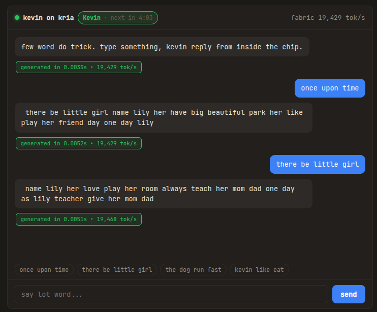
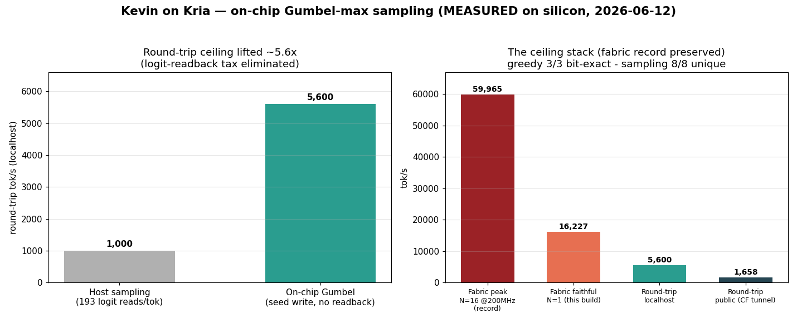

# Kevin on Kria

> *Why waste BRAM say lot word when few word do trick.*

A tiny language model that runs entirely inside the FPGA fabric of a Xilinx Kria
KV260: weights resident in on-chip BRAM/URAM so they never touch DDR, trained on
telegraphic text so it talks like Kevin Malone. The joke is the thesis: a model
small enough to live on-chip is necessarily dumb, and on-chip residency is the
*only* thing that beats the board's Arm cores. **Being dumb and being fast are
the same property.**

Talk to it live at [chat.mikeayles.com](https://chat.mikeayles.com):



This repo holds the code end to end: the data tool, the model, the fabric RTL,
and the serving stack.

## The two facts it hangs on

1. **The bandwidth wall.** Single-stream decode is memory-bandwidth bound. On the
   KV260 the A53 cores and the PL fabric share one ~20 GB/s DDR controller, so a
   DDR-resident model gets no uplift from the fabric. The only escape is keeping
   the whole model (~1–2 MB, INT4) in on-chip memory at hundreds of GB/s to TB/s.
2. **The fusion.** Telegraphic output = fewer tokens = less weight streamed and a
   smaller KV cache = more fits on-chip = faster. The compression is the comedy
   *and* the optimisation.

## Code

| dir | what |
|---|---|
| [`keviniser/`](keviniser/) | the Keviniser preprocessor + corpus harness + TinyStories fetcher ([README](keviniser/README.md)) |
| [`model/`](model/) | a 2–4M-param nanoGPT-scale model, trainer, sampler, evolution renderer ([README](model/README.md)) |
| [`fabric/`](fabric/) | the RTL, the integer golden reference, the bit-exact gate harnesses, and the engineering logs |
| [`webchat/`](webchat/) | the serving stack: A53 daemon, WebSocket backend, speculative-typing client, load dashboard ([README](webchat/demo/README.md)) |
| [`bench/`](bench/) | CPU/GPU reference benchmarks (ONNX Runtime, CUDA) for the comparison numbers |
| [`tests/`](tests/) | pytest suite for the Keviniser |

## The speed ladder


Every green rung is **MEASURED on silicon** (3/3 runs, token-stream bit-exact
vs the integer reference). The current state, all bit-honest:

| What | tok/s | Tag |
|---|---|---|
| Single-pass N=8, one weight pass serves all 8 streams (69,172 cyc / 8 tokens @166.7 MHz) | 19,275.6 | MEASURED |
| N=16, 12 DSP-packed banks + shared LN/attention (110,494 cyc / 16 tokens @166.7 MHz) | 24,134.0 | MEASURED |
| + softmax latency cut (103,582 cyc / 16 tokens @166.7 MHz), **the stream ceiling** | 25,744.5 | MEASURED |
| **Split-brain** N=14, two cohorts on the dual-ported URAM (63,113 cyc / 14 tokens @166.7 MHz) | 36,970.7 | MEASURED |
| N=16 @ **200 MHz**, first 200-clean build (LN un-retime + AQ 32×48 range-proof) | 46,604.4 | MEASURED |
| + schedule-pipelining wave (AQ/RUN overlap, stream-granular NL, attn call cuts; 56,876 cyc @200 MHz) | 56,262.7 | MEASURED |
| + TMAX=16 architectural wave (TMAX 32→16, CTX cross-group stream, LN prod×gamma split; 53,364 cyc @200 MHz) | **59,965.5** | MEASURED |

Past 25.7k, **N=16 is the stream ceiling**: 3 INT4×INT8 MACs/DSP is provably
impossible (27-bit port vs 28 needed; 66 bits of neuron state vs a 48-bit
accumulator; `fabric/stage3/research/dsp3_pack_proof.py`, 1.2M-trial verified),
so the levers became **cycles and clock, not streams**: split-brain (two N=8
cohorts on the true-dual-port URAM) plus a systematic worst-path-retirement
campaign. **59,965.5 is the current MEASURED record** (16/16 bit-exact, 3/3).
The 100k target was chased and honestly disowned: the cycle floor and the
250 MHz hard wall (the fabric hangs) put the real ceiling of this architecture
on this chip at 62k to 78k.

References (same model, B=1 greedy): A53 char chat = 11 tok/s · XPS15 ONNX Runtime
CPU 1,273 · RTX 3050 Ti 719. The FPGA's **16-stream aggregate** beats the laptop
GPU ~83×; the fair single-stream comparison is the faithful N=1 build at ~19,240
tok/s, **~27×** the GPU at the same B=1.

## The two ceilings (fabric vs round-trip)



The fabric record and what a live chat user actually feels are two different
numbers. The **fabric peak** (59,965.5 tok/s, N=16 @200 MHz) is pure PL cycles;
the **faithful single stream** (N=1, the deployed chat build) runs **19,242
tok/s** of fabric by counted cycles (10,394 cyc/tok measured; the average falls
as the attention window fills). A LayerNorm wide-word congestion cut (−11.9k FF /
−3.8k LUT) closed timing at 142.9 MHz (WNS +0.012, was −1.385) and overclocked
bit-exact to 200 MHz on silicon (up from the old 166.7 MHz / ~16.2k ceiling).
Live, a 2,000-connection bench holds **~21,300 tok/s** flat across the whole
sweep (peak 21,479, ~12,000 replies, zero errors): longer replies amortize the
fixed per-inference overhead. But the **round-trip** a user sees is far below
all of that; it's bound by serving, not silicon.

The biggest round-trip tax was **sampling**: the host read 193 head logits per
token back over `/dev/mem` to do temperature sampling on the A53 (~58 % of a
reply). Moving it **on-chip via the Gumbel-max trick** (sampling from
`softmax(logit/T)` is exactly `argmax(logit + T·g)`, `g ~ Gumbel`, so the
existing argmax hardware does it and the host writes **one seed register per
request** instead of 193 reads per token) lifted the localhost round-trip
ceiling **~5.6× (1k → 5,600 tok/s)** while keeping the fabric record bit-exact
(greedy 3/3, sampling 8/8 unique). The public number (~1,658 tok/s through the
Cloudflare tunnel) is the remaining WAN+tunnel RTT, not fabric.

## Kevin outgrows the chip (the Genesys2 port)

A second, harder board: a [Digilent Genesys2](https://digilent.com/reference/programmable-logic/genesys-2/start)
(Kintex-7, `xc7k325tffg900-2`) with X-HEEP + a `cv32e40px` RISC-V core instead
of the Kria's Arm cores, and **no URAM primitive at all** — the resident
weight/KV storage that makes the KV260 build fast has to fit in an ordinary
BRAM tile budget instead. Full engineering log:
[`fabric/genesys2/PORT-NOTES.md`](fabric/genesys2/PORT-NOTES.md).

**Option A (fully on-chip)**: d=128, 2 layers, 2 heads, the 57-char Kevin-speak
vocab (0.40M params), weights and KV cache both BRAM-resident — the same
"everything on-chip, zero DRAM in the token loop" bet as the KV260 build, on a
part with no URAM to make it easy. Measured on real Genesys2 hardware, 50MHz,
bit-exact against the integer golden reference: **~11,930-11,985 tok/s**.

**Option B (DDR3-streamed, 2x the depth)**: Option A's own ceiling turned out
to be BRAM, not compute — its DSP usage sits at 95.6% and (verified
empirically across five different model shapes, from RTL inspection through
real synthesis) stays there regardless of depth or width, since it's bounded
by the fixed per-lane pipeline, not by layer count. So the
KV cache and the weight image now stream through the board's DDR3 instead of
sitting resident, via two new modules (`kv_bank_ddr.sv`, `weight_loader_ddr.sv`)
riding the fork's existing DMA infrastructure. Result: d=128, 4 layers (2x
Option A's depth), 0.79M params — a genuinely bigger model than a BRAM-only
build on this chip could ever hold. Real hardware, bit-exact, weights staged
into DDR3 over JTAG and loaded entirely through the DMA path (the model's
492KB weight image doesn't even fit in the 384KB on-chip RAM the boot-time
register stream would otherwise use): **~3,120 tok/s** — honestly ~3.8x
slower than Option A, the real cost of two DDR3 round-trips a token instead
of zero. The point isn't speed; it's that streaming buys a model this board
couldn't host any other way, at a bounded, measured price.

Getting both variants right surfaced real, previously-unknown RTL bugs, each
caught by the same bit-exact-before-synthesis discipline as the KV260
build — not found on real silicon after the fact: a clock-domain-crossing
gap in the DDR arbiter's first draft (every earlier sim gate shared one
clock, hiding it), a 4-bit progress counter that silently wrapped and
deadlocked any GEMV needing 16+ output groups, and three ROM-capacity
constants hardcoded to fit exactly the original reference shape, silently
corrupting anything deeper with no error at all.

**Per-layer weight streaming (breaking the BRAM depth ceiling)**: Option B's
own DDR3 streaming still loaded the *whole* weight image once and kept it
resident — depth was still capped by BRAM. The real fix: stop keeping any
of it resident at all. `sequencer_vec.sv`'s own FSM now reloads just the
*current* block's window (or the embed tables, or the head's window) from
DDR3 on demand, once per block per token, via `weight_loader_ddr.sv` —
making weight-bank BRAM cost independent of depth for the first time. That
unlocked real depth growth on real hardware: NLAYER 4 → 8 → 12, the last
sourced by finding and fixing a genuinely data-limited training bug (the
~19M-char validation-split corpus was too small for a 12-layer model;
switching to the full ~1.9GB TinyStories train split fixed it) — best val
loss **0.772 FP / 0.785 QAT**, the best quality this project has produced,
confirmed on real hardware with coherent multi-sentence completions at
**~130 tok/s** (~385k cycles/token, 50MHz). Two further attempts (NLAYER=16,
D=256 width instead of depth) were tried and reported honestly as dead
ends — NLAYER=16 showed no real quality gain over NLAYER=12, and D=256 hit
a genuine training instability (not overfitting, not a learning-rate issue)
that wasn't chased further. The board also grew a real **untethered
interactive chat mode** (`kevgpt_interactive`): weights load over the same
UART cable a chat session uses (`fabric/genesys2/send_weights.py`), no
JTAG/GDB session needed to drive a run.

**Word-level vocabulary (current)**: char-level spends most of every reply's
token budget spelling words out one character at a time. Swapping in a
fixed ~1900-word tokenizer (`model/word_data.py` — plain regex split, no
BPE) lets the same `TMAX=128` context cover many more *words* instead of
many more *characters*, at the cost of a much bigger embed/head table
(`VOCAB` 57 → 1900, `WWORDS` 3,072 → 32,768 words to cover the new reload
window). Real synth stayed clean at the bigger vocab — LUTs 47.9%, Block
RAM 89.4% (still inside the same BRAM-bucket boundary the char-level build
used), DSPs 95.7% (vocab-independent, as expected), timing positive
(WNS=1.65ns) — and real hardware chat works end-to-end (weight stream,
tokenized encode, on-chip sampling, word-level decode). Stated honestly,
not swept under "it works": the sampled real-hardware text is rougher and
more repetitive than the char-level build's own sampled chat, and
per-token throughput at this shape hasn't been measured on real hardware
yet — open questions, not yet resolved. Full engineering log, including
every RTL bug found sizing a much bigger VOCAB into registers that were
only ever sized for the char-level range:
[`fabric/genesys2/PORT-NOTES.md`](fabric/genesys2/PORT-NOTES.md).

## What works today

- **Keviniser**: POS-based so it keeps main-verb "do" and drops auxiliary "do".
  The **full TinyStories train split is processed**: 2,119,718 stories,
  371.7M → 260.5M words (**70.1%**), ~67% tokens (gpt2 proxy), the headline
  compression metric, holding constant from the validation slice to the full
  corpus. ~2.9 h on the M1 with `--nproc 7`. Output is the ~1.3 GB Kevin training
  corpus the GPU run consumes.
- **Proof-of-life model**: a 3.16M-param char-level GPT trained on the Kevinised
  validation set climbs from random characters to coherent telegraphic Kevin in
  ~35 min on an M1, ~4 min on an RTX 3050 Ti (see `data/evolution.md` after a run).
- **Brevitas INT4 QAT path** (`model/qgpt.py`): the same architecture with every
  `nn.Linear` swapped for INT4-weight / INT8-activation `QuantLinear`. Warm-starts
  from an FP checkpoint via `--init-from`; inherits FP val loss within ~0.01 nats
  on the smoke test, which is the bit-honesty signal that the remap is faithful.

- **Fabric path (PL prep, no board needed)**: a roofline/crossover model (3.15M
  model = 1.5 MB INT4, fits the ~3 MB budget; crossover ~6.3M params); INT4
  weight export to `$readmemh` images + per-channel scales; a numpy integer
  golden ("goformer"); a **Stage 1 SystemVerilog systolic GEMV** verified
  bit-exact (`maxabserr=0`) against the golden on all 17 layers in iverilog and
  synthesised in Vivado for the KV260 part; a cosine validator showing the
  exported integer datapath reconstructs the Brevitas QAT forward to **cosine
  1.000** (gate > 0.9999); and a **Stage 0** A53 weight-streaming baseline (the
  bandwidth-wall proof).

- **Stage 3 on silicon**: the full forward (4 blocks + LN_f + head + argmax) runs
  inside the PL with zero DRAM in the token loop: weights in URAM, activations and
  KV in BRAM. Bit-honest gate ladder: every RTL block is iverilog bit-exact vs
  `seq_ref` before silicon, and tok/s claims need 3/3 bit-exact runs. Engineering
  log: `fabric/stage3/WIDE-WORD-DATAPATH-LOG.md`. The current design is
  **split-brain N=16**: two independent 8-stream cohorts each read the resident
  weight image through their own true-dual-port URAM port, sharing only the
  weight image and arbitrated non-linears; 59,965.5 tok/s @ 200 MHz, 16/16 streams
  bit-exact, 3/3. The 16 streams double as keystroke-speculative completions
  (every keypress forks a stream; Enter blits the precomputed answer).
- **KV-to-DDR (sim-complete, bit-exact)**: `kv_dma` + `kv_prefetch` move the KV cache
  off-chip with double-buffered burst prefetch that fully hides DDR latency, restoring
  the context the on-chip window gives up. At K4/V4 quantized KV the read budget for
  100k aggregate tok/s is ~3.89 GB/s (DERIVED), under the ~6–7.5 GB/s sustained HP
  ceiling, so DDR is not the binding wall.

## Getting started (reproducing it)

There are three tiers of reproduction, in increasing hardware cost. **Tiers 1–2
need no FPGA**; tier 2 is where the load-bearing "bit-honest" claim can be checked
by anyone, in software.

```
python -m venv .venv && source .venv/bin/activate   # Windows: .venv\Scripts\activate
pip install -r requirements.txt
python -m spacy download en_core_web_sm
```

### Tier 1: the data tool and the model (CPU, or a GPU to go big)

```
# Kevinise the bundled sample (the whole joke in one line)
python -m keviniser.harness samples/canonical.txt
#  -> why us waste time say lot word when few word do trick

# The real thing: fetch TinyStories, Kevinise it, train a tiny model, sample it
python -m keviniser.fetch_tinystories                       # validation split (~20 MB)
python -m keviniser.harness data/TinyStories-valid.txt \
    -o data/TinyStories-valid.kevin.txt --marker "<|endoftext|>"
python -m model.train --max-iters 4000                      # ~37 min M1, ~4 min RTX 3050 Ti
python -m model.sample data/ckpt.pt --prompt "once upon time"

# Optional: INT4 QAT fine-tune off the FP checkpoint (requires `pip install brevitas`)
python -m model.train --qat --init-from data/ckpt.pt --max-iters 2000 \
    --out data/ckpt.qat.pt
```

Training the **full** corpus belongs on a CUDA GPU; see
[`model/SETUP-DELL.md`](model/SETUP-DELL.md).

### Tier 2: the bit-exact fabric gates (needs `iverilog`, no board)

This is the reproducible core of the honesty claim: **every RTL block is proven
bit-identical (or cosine > 0.9999 for the transcendental LUTs) to a Python integer
reference in [Icarus Verilog](https://steveicarus.github.io/iverilog/) simulation,
before any silicon or speed number.** Each `run_*.py` harness writes the `.mem`
weight images, compiles the RTL with `iverilog -g2012`, runs `vvp`, and diffs every
intermediate against `seq_ref.py`, printing a one-line `*_VERDICT`.

```
# Debian/Ubuntu: sudo apt install iverilog   |   macOS: brew install icarus-verilog
python -m fabric.stage3.run_gelu             # GELU LUT vs exact GELU  -> GELU_VERDICT bitexact=True
python -m fabric.stage3.run_layernorm        # fabric-precision LayerNorm
python -m fabric.stage3.run_softmax          # fabric-precision softmax
python -m fabric.stage3.run_banked           # the systolic INT4 GEMV, bit-exact across PE widths
python -m fabric.stage3.run_vec_seq          # a full single-token forward through the sequencer
```

Scratch build files default to `<system-temp>/kevbuild` (e.g. `/tmp/kevbuild`);
override with `--dir <path>` where a harness accepts it, or set `KEV_SIM_DIR` for
all of them. Green verdicts here are what the on-silicon tok/s numbers are measured
*against*: if a gate is red, no speed number from that block is trusted.

### Tier 3: on the board (needs a Kria KV260 + Vivado 2025.2)

Synthesis, implementation, bitstream, and the on-board `--fclk` sweep need the
hardware and the Xilinx toolchain; the commands live in the engineering log
[`fabric/stage3/WIDE-WORD-DATAPATH-LOG.md`](fabric/stage3/WIDE-WORD-DATAPATH-LOG.md).
This tier is not reproducible without the ~$250 board, and that is stated honestly:
the silicon numbers are ours, but the *method* that makes them trustworthy (tier 2)
runs on your laptop.

## How to read the Verilog (for software engineers)

The fabric is hand and LLM written RTL (me and Claude Code, no HLS). If you write
software, three ideas get you
most of the way, and the real modules in [`fabric/stage3/rtl/`](fabric/stage3/rtl/)
are small enough to read. Verilog describes **hardware that all exists at once**, not
a sequence of instructions.

**1. A module is a function whose arguments are wires of a fixed bit-width.** Here is
the whole GELU activation, as an 8192-entry lookup table
([`rtl/gelu_lut.sv`](fabric/stage3/rtl/gelu_lut.sv)):

```systemverilog
module gelu_lut (
    input  wire                clk,
    input  wire signed [15:0]  x,      // Q4.12 fixed-point in
    output reg  signed [15:0]  y       // Q4.12 fixed-point out
);
```

`[15:0]` means a 16-bit bus: there are no ints, floats, or growable types; every
value is a fixed pile of bits you size yourself. `signed` says how to interpret them.
`Q4.12` is fixed-point: 4 integer bits, 12 fractional. Floats cost too much fabric,
so the whole model runs in scaled integers.

**2. `always @(posedge clk)` is "do this on every rising clock edge."** It is the only
notion of time. A `reg` updated inside one is a hardware register (a latch of flip-flops)
that remembers its value between ticks; a `wire`/`assign` is just combinational logic that
settles continuously. The GELU is a **3-stage pipeline**: each `always @(posedge clk)`
is one stage, so a new `x` enters every cycle and its `y` pops out 3 cycles later, with
three different inputs in flight at once:

```systemverilog
always @(posedge clk) u  <= x + 16'h8000;          // stage 0: recenter the index
always @(posedge clk) begin                         // stage 1: two registered LUT reads
    l0 <= lut[idx];  l1 <= lut[idx1];  f1 <= frac;
end
always @(posedge clk) y <= l0 + (step >>> 3);       // stage 2: linear interpolate
```

`<=` is not assignment; it schedules all the registers in a block to update *together*
at the edge (that is why order inside the block does not matter). `>>>` is an arithmetic
shift (a cheap divide-by-8). Reads and writes here are not statements that run in order;
they are wires and latches that are all physically present and all active every cycle.

**3. The parallelism is spatial: `generate`/`for` stamps out copies of hardware.** The
heart of a neural net is multiply-accumulate, and here it is, one stream's 128 lanes
([`rtl/gemm_banked_resident_vec.sv`](fabric/stage3/rtl/gemm_banked_resident_vec.sv)):

```systemverilog
generate
    for (gl = 0; gl < LANES; gl = gl + 1) begin : g_l
        reg signed [ABITS-1:0] a;                   // this lane's accumulator
        always @(posedge clk) begin
            if (clr)      a <= 0;
            else if (en)  a <= a + $signed(w[gl*4 +: 4]) * x;   // a += w[gl] * x
        end
        assign acc[gl*ABITS +: ABITS] = a;
    end
endgenerate
```

That `for` loop is **not** a loop that runs 128 times in sequence; it lays down 128
physical multiply-accumulate units that all fire on the same clock edge. Every cycle,
one shared activation `x` is multiplied by 128 different INT4 weights and added into 128
separate accumulators, simultaneously. `w[gl*4 +: 4]` is the part-select idiom: "4 bits
starting at bit `gl*4`", one INT4 weight sliced out of a packed bus. Speed on the fabric
comes from doing more of these in parallel per cycle, and from clocking them faster, which
is the entire speed ladder above.

**Where it stops feeling like software: the memory layout is physical.** A naive 2-D array
indexed by a runtime value (`buf[lane][row]`) synthesises to a giant per-lane mux tree that
blows up the chip; the same data as one wide word per row (`reg [P*32-1:0] bank [0:ROWS-1]`,
lane `l` at bits `[l*32 +: 32]`) makes the row a memory *address* instead of a mux, and fits.
That refactor, same math but a different physical shape, is a recurring move in this repo (see
[`rtl/layernorm_vec.sv`](fabric/stage3/rtl/layernorm_vec.sv)) and the kind of thing that has
no analogue in software. The `seq_ref.py` integer reference is the file to keep open while
reading the rest.

## Data & checkpoints (GitHub as Dropbox)

This project spans two machines: the **M1** runs the Keviniser (CPU/spaCy) and
the **XPS 15 / RTX 3050 Ti** does the training (CUDA). The handoff is a single
~1.3 GB corpus file, and the big artifacts (corpora, checkpoints) are gitignored
and *not* in the repo. So we abuse **GitHub Releases as an artifact store**, a
free Dropbox that lives next to the code:

- A direct `git commit` is the wrong tool: GitHub **hard-rejects files > 100 MB**,
  and a committed binary bloats clone history *forever*.
- A **Release asset** allows **up to 2 GB per file**, lives *outside* git history
  (zero repo bloat), and is one command each way.

**Current artifacts:**

| release | asset | what |
|---|---|---|
| [`corpus-v1`](https://github.com/MichaelAyles/kev-gpt/releases/tag/corpus-v1) | `TinyStories-train.kevin.txt.gz` (394 MB) | the full Kevinised train corpus, gzipped |

**Pull an artifact (e.g. on the Dell):**

```
gh release download corpus-v1 -R michaelayles/kev-gpt -D data/
# verify against the sha256 in the release notes, then gunzip
```

**Publish a new artifact (e.g. a trained checkpoint):**

```
gzip -k data/ckpt.pt
shasum -a 256 data/ckpt.pt.gz          # put the hash in the notes
gh release create ckpt-v1 data/ckpt.pt.gz --title "..." --notes "sha256: ..."
```

The repo is public, so release assets are too: `gh release download` (or the
browser) pulls them without auth. Code travels through normal git; only the
multi-hundred-MB blobs go through Releases.

## Conventions (project rules)

- **Mischief in the title, dry in the body.** The output prose is deliberately
  bad; the speed numbers carry the story.
- **Honest-first.** Every claim states where the approach loses. The roofline
  crossover (where the fabric stops winning) is a result, not a caveat.
- **Bit-honest before fast.** Fabric output is validated against goformer to
  cosine > 0.9999 before any speed number is trusted.

## Hardware split

The Keviniser is CPU work (spaCy); training is GPU work (the 3050 Ti, where INT4
QAT also lives); inference is the FPGA fabric. They don't compete: different
machines for different stages.
