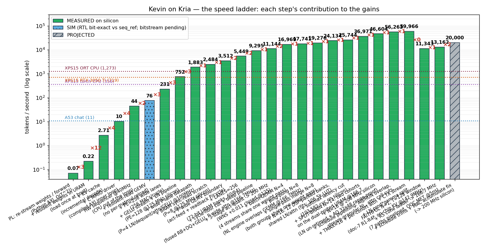

# Kevin on Kria

> *Why waste BRAM say lot word when few word do trick.*

A tiny language model that runs entirely inside the FPGA fabric of a Xilinx Kria
KV260 — weights baked into on-chip BRAM/URAM so they never touch DDR — trained on
telegraphic text so it talks like Kevin Malone. The joke is the thesis: a model
small enough to live on-chip is necessarily dumb, and on-chip residency is the
*only* thing that beats the board's Arm cores. **Being dumb and being fast are
the same property.**

This repo holds both the **design notes** (the argument) and the **code** (the
data tool and the model) for that project.

## The two facts it hangs on

1. **The bandwidth wall.** Single-stream decode is memory-bandwidth bound. On the
   KV260 the A53 cores and the PL fabric share one ~20 GB/s DDR controller, so a
   DDR-resident model gets no uplift from the fabric. The only escape is keeping
   the whole model (~1–2 MB, INT4) in on-chip memory at hundreds of GB/s to TB/s.
2. **The fusion.** Telegraphic output = fewer tokens = less weight streamed and a
   smaller KV cache = more fits on-chip = faster. The compression is the comedy
   *and* the optimisation.

## Design docs (read in order)

| doc | what |
|---|---|
| [`0-master.md`](0-master.md) | the through-line, the four-piece map, the build order |
| [`1-keviniser.md`](1-keviniser.md) | **the data tool** — POS-based telegraphic preprocessor |
| [`2-llm-on-kria.md`](2-llm-on-kria.md) | **the platform** — on-chip systolic GEMV, fabric-native softmax/RMSNorm |
| [`3-kevin-on-kria.md`](3-kevin-on-kria.md) | **the fusion** — train doc 2's model on doc 1's corpus |
| [`4-live-chatbot.md`](4-live-chatbot.md) | **the stress test** — serve it behind a Cloudflare Tunnel, link on HN |
| [`5-demo-prd.md`](5-demo-prd.md) | **the demo PRD** — speculative-typing chat + live load dashboard |
| [`6-past-the-stream-ceiling.md`](6-past-the-stream-ceiling.md) | **the speed campaign** — split-brain + worst-path retirement past the stream ceiling, toward 100k |

## Code

| dir | what |
|---|---|
| [`keviniser/`](keviniser/) | the Keviniser preprocessor + corpus harness + TinyStories fetcher ([README](keviniser/README.md)) |
| [`model/`](model/) | a 2–4M-param nanoGPT-scale model, trainer, sampler, evolution renderer ([README](model/README.md)) |
| [`tests/`](tests/) | pytest suite for the Keviniser |

## The speed ladder



Every green rung is **MEASURED on silicon** (3/3 runs, token-stream bit-exact
vs the integer reference). The current state, all bit-honest:

| What | tok/s | Tag |
|---|---|---|
| Single-pass N=8 — one weight pass serves all 8 streams (69,172 cyc / 8 tokens @166.7 MHz) | 19,275.6 | MEASURED |
| N=16 — 12 DSP-packed banks + shared LN/attention (110,494 cyc / 16 tokens @166.7 MHz) | 24,134.0 | MEASURED |
| + softmax latency cut (103,582 cyc / 16 tokens @166.7 MHz) — **the stream ceiling** | 25,744.5 | MEASURED |
| **Split-brain** N=14 — two cohorts on the dual-ported URAM (63,113 cyc / 14 tokens @166.7 MHz) | 36,970.7 | MEASURED |
| N=16 @ **200 MHz** — first 200-clean build (LN un-retime + AQ 32×48 range-proof) | 46,604.4 | MEASURED |
| + schedule-pipelining wave (AQ/RUN overlap, stream-granular NL, attn call cuts; 56,876 cyc @200 MHz) | 56,262.7 | MEASURED |
| + TMAX=16 architectural wave (TMAX 32→16, CTX cross-group stream, LN prod×gamma split; 53,364 cyc @200 MHz) | **59,965.5** | MEASURED |
| Cycle floor (~53k → ~40k cyc) × 250 MHz silicon | →100k | the 100k identity: 16 × 250 MHz / 40k cyc, PROJECTED |

Past 25.7k, **N=16 is the stream ceiling**: 3 INT4×INT8 MACs/DSP is provably
impossible (27-bit port vs 28 needed; 66 bits of neuron state vs a 48-bit
accumulator — `fabric/stage3/research/dsp3_pack_proof.py`, 1.2M-trial verified),
so the levers became **cycles and clock, not streams** — the second era, documented
in [`6-past-the-stream-ceiling.md`](6-past-the-stream-ceiling.md): split-brain
(two N=8 cohorts on the true-dual-port URAM) plus a systematic worst-path-retirement
campaign. **59,965.5 is the current MEASURED record** (16/16 bit-exact, 3/3); 100k
is PROJECTED and needs both the cycle floor *and* 250 MHz on silicon.

References (same model, B=1 greedy): A53 char chat = 11 tok/s · XPS15 ONNX Runtime
CPU 1,273 · RTX 3050 Ti 719 — the FPGA beats a laptop GPU ~78×.

## What works today

- **Keviniser**: POS-based so it keeps main-verb "do" and drops auxiliary "do".
  The **full TinyStories train split is processed**: 2,119,718 stories,
  371.7M → 260.5M words (**70.1%**), ~67% tokens (gpt2 proxy) — the headline
  compression metric, holding constant from the validation slice to the full
  corpus. ~2.9 h on the M1 with `--nproc 7`. Output is the ~1.3 GB Kevin training
  corpus the GPU run consumes.
- **Proof-of-life model**: a 3.16M-param char-level GPT trained on the Kevinised
  validation set climbs from random characters to coherent telegraphic Kevin in
  ~35 min on an M1, ~4 min on an RTX 3050 Ti (see `data/evolution.md` after a run).
- **Brevitas INT4 QAT path** (`model/qgpt.py`): the same architecture with every
  `nn.Linear` swapped for INT4-weight / INT8-activation `QuantLinear`. Warm-starts
  from an FP checkpoint via `--init-from`; inherits FP val loss within ~0.01 nats
  on the smoke test, which is the bit-honesty signal that the remap is faithful.

- **Fabric path (PL prep, no board needed)**: a roofline/crossover model (3.15M
  model = 1.5 MB INT4, fits the ~3 MB budget; crossover ~6.3M params); INT4
  weight export to `$readmemh` images + per-channel scales; a numpy integer
  golden ("goformer"); a **Stage 1 SystemVerilog systolic GEMV** verified
  bit-exact (`maxabserr=0`) against the golden on all 17 layers in iverilog and
  synthesised in Vivado for the KV260 part; a cosine validator showing the
  exported integer datapath reconstructs the Brevitas QAT forward to **cosine
  1.000** (gate > 0.9999); and a **Stage 0** A53 weight-streaming baseline (the
  bandwidth-wall proof).

- **Stage 3 on silicon**: the full forward (4 blocks + LN_f + head + argmax) runs
  inside the PL with zero DRAM in the token loop — weights in URAM, activations and
  KV in BRAM. Bit-honest gate ladder: every RTL block is iverilog bit-exact vs
  `seq_ref` before silicon, and tok/s claims need 3/3 bit-exact runs. Engineering
  log: `fabric/stage3/WIDE-WORD-DATAPATH-LOG.md`; the narrative is doc 6. The current
  design is **split-brain N=16**: two independent 8-stream cohorts each read the
  resident weight image through their own true-dual-port URAM port, sharing only the
  weight image and arbitrated non-linears — 59,965.5 tok/s @ 200 MHz, 16/16 streams
  bit-exact, 3/3. The 16 streams double as keystroke-speculative completions (every
  keypress forks a stream; Enter blits the precomputed answer — doc 5).
- **KV-to-DDR (sim-complete, bit-exact)**: `kv_dma` + `kv_prefetch` move the KV cache
  off-chip with double-buffered burst prefetch that fully hides DDR latency, restoring
  the context the on-chip window gives up. At K4/V4 quantized KV the read budget for
  100k aggregate tok/s is ~3.89 GB/s (DERIVED) — under the ~6–7.5 GB/s sustained HP
  ceiling, so DDR is not the binding wall.

## Quickstart

```
python -m venv .venv && source .venv/bin/activate   # Windows: .venv\Scripts\activate
pip install -r requirements.txt
python -m spacy download en_core_web_sm

# Kevinise the bundled sample
python -m keviniser.harness samples/canonical.txt
#  -> why us waste time say lot word when few word do trick

# Or the real thing: fetch TinyStories, Kevinise it, train a tiny model
python -m keviniser.fetch_tinystories                       # validation split (~20 MB)
python -m keviniser.harness data/TinyStories-valid.txt \
    -o data/TinyStories-valid.kevin.txt --marker "<|endoftext|>"
python -m model.train --max-iters 4000                      # ~37 min M1, ~4 min RTX 3050 Ti
python -m model.sample data/ckpt.pt --prompt "once upon time"

# Optional: INT4 QAT fine-tune off the FP checkpoint (requires `pip install brevitas`)
python -m model.train --qat --init-from data/ckpt.pt --max-iters 2000 \
    --out data/ckpt.qat.pt
```

Training the **full** corpus belongs on a CUDA GPU — see
[`model/SETUP-DELL.md`](model/SETUP-DELL.md).

## Data & checkpoints (GitHub as Dropbox)

This project spans two machines — the **M1** runs the Keviniser (CPU/spaCy) and
the **XPS 15 / RTX 3050 Ti** does the training (CUDA). The handoff is a single
~1.3 GB corpus file, and the big artifacts (corpora, checkpoints) are gitignored
and *not* in the repo. So we abuse **GitHub Releases as an artifact store** — a
free Dropbox that lives next to the code:

- A direct `git commit` is the wrong tool: GitHub **hard-rejects files > 100 MB**,
  and a committed binary bloats clone history *forever*.
- A **Release asset** allows **up to 2 GB per file**, lives *outside* git history
  (zero repo bloat), and is one command each way.

**Current artifacts:**

| release | asset | what |
|---|---|---|
| [`corpus-v1`](https://github.com/michaelayles/kev-gpt/releases/tag/corpus-v1) | `TinyStories-train.kevin.txt.gz` (394 MB) | the full Kevinised train corpus, gzipped |

**Pull an artifact (e.g. on the Dell):**

```
gh release download corpus-v1 -R michaelayles/kev-gpt -D data/
# verify against the sha256 in the release notes, then gunzip
```

**Publish a new artifact (e.g. a trained checkpoint):**

```
gzip -k data/ckpt.pt
shasum -a 256 data/ckpt.pt.gz          # put the hash in the notes
gh release create ckpt-v1 data/ckpt.pt.gz --title "..." --notes "sha256: ..."
```

The repo is **private**, so release assets are private too — `gh` auth (or a
token) is required to download. Code and docs travel through normal git; only the
multi-hundred-MB blobs go through Releases.

## Conventions (project rules, honored in the docs)

- **Mischief in the title, dry in the body.** The output prose is deliberately
  bad; the speed numbers carry the story.
- **Honest-first.** Every doc states where the approach loses. The roofline
  crossover (where the fabric stops winning) is a result, not a caveat.
- **Bit-honest before fast.** Fabric output is validated against goformer to
  cosine > 0.9999 before any speed number is trusted.

## Hardware split

The Keviniser is CPU work (spaCy); training is GPU work (the 3050 Ti, where INT4
QAT also lives); inference is the FPGA fabric. They don't compete — different
machines for different stages.
